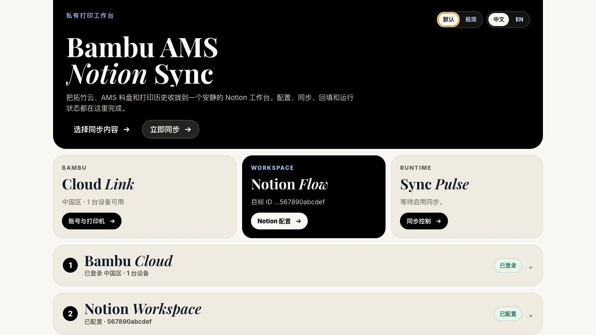
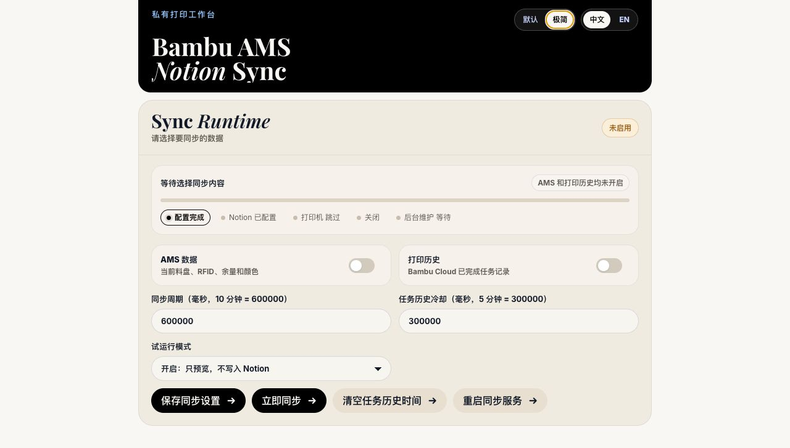

# bambu-ams-notion-sync

把 Bambu Lab 打印机、AMS 耗材和打印历史同步到 Notion 的小型自托管服务。它提供一个本地 Web 控制台，用来登录拓竹云、选择打印机、配置 Notion、预览同步状态，并把耗材 RFID、余量、颜色、打印任务和耗材用量整理成 Notion 数据库。

项目会维护一组独立的 Notion 子数据库。最常用的是 `AMS 耗材`，你原来的 `耗材管理` 表继续作为人工主表；在 Notion 里给它加 Relation 关联 `AMS 耗材` 后，就可以按 RFID 绑定真实耗材。开启打印历史后，还会维护 `打印记录`、`耗材用量明细`、`耗材色卡` 和 `颜色映射`。

```text
Bambu Cloud / 局域网 MQTT
  -> 本地同步服务
  -> Notion 托管子数据库
  -> 你的耗材管理、打印记录和统计视图
```

## 界面预览

默认模式适合完整配置和查看总体状态：



极简模式只展示当前需要处理的配置面板，适合部署后日常使用：



## 能做什么

- 同步 AMS 当前料盘：材料、RFID Tag UID、Tray UUID、余量百分比、估算剩余克数和颜色。
- 自动给 `AMS 耗材` 页面设置色块 icon，Notion Relation 选择器里能直接看颜色。
- 同步 Bambu Cloud 已完成任务，记录打印配置、时间、状态、进度、缩略图、完成截图和耗材用量。
- 自动创建和复用 Notion 子数据库，并在字段缺失或字段类型冲突时尽量自修复。
- 支持云端同步和局域网 MQTT 两种模式；云端模式适合打印机不在当前局域网的场景。
- 默认关闭写入开关，并提供试运行模式，确认无误后再正式写入 Notion。

## 推荐用法：Docker + Web 控制台

用仓库自带的 `docker-compose.yml` 启动服务：

```bash
docker compose up -d --build
```

打开：

```text
http://localhost:3030
```

网页会显示配置控制台。默认模式会展示完整状态卡片；右上角切到 `极简` 后，只会展示下一步需要处理的面板：

1. 用 `拓竹云` 登录拓竹账号。国内账号选 `中国区`，海外账号选 `海外区`；手机号和邮箱都可以。
2. 登录成功后，在设备列表里点 `使用这台打印机`。
3. 填 Notion 密钥和 Notion 页面 ID。
4. 打开你需要的同步开关：`AMS 数据` 或 `打印历史`。默认两个都是关闭的，不会自动写入 Notion。
5. 第一次建议把 `试运行模式` 保持为 `开启：只预览，不写入 Notion`，点保存后查看同步状态。
6. 确认没问题后改成 `关闭：正式写入 Notion`。AMS 数据会按同步周期刷新，也可以点 `立即同步` 手动触发；打印历史开关打开后会拉取 Bambu Cloud 已完成任务。

Docker 会把配置和拓竹云登录凭据保存在本地：

```text
./data/app-config.json
./data/bambu-cloud.json
```

这些文件包含 token，已经在 `.gitignore` 里。

这个 Web 控制台目前没有登录鉴权，建议只在本机、可信局域网或 VPN 内访问，不要直接暴露到公网。

## Docker 镜像和持久化

这个项目的容器启动后只运行 Web 控制台；配置、登录和同步都在页面里完成。镜像本身不包含任何 token，运行时需要把 `/app/data` 映射出来做持久化缓存。

手动构建镜像：

```bash
docker build -t bambu-ams-notion-sync:latest .
```

不用 Compose 时也可以直接运行：

```bash
mkdir -p ./data
docker run -d \
  --name bambu-ams-notion-sync \
  --restart unless-stopped \
  -p 3030:3030 \
  -v "$(pwd)/data:/app/data" \
  bambu-ams-notion-sync:latest
```

持久化文件说明：

| 宿主机文件 | 容器内路径 | 说明 |
| --- | --- | --- |
| `./data/app-config.json` | `/app/data/app-config.json` | Web 页面保存的同步配置，例如 Notion 页面 ID、同步周期、试运行模式 |
| `./data/bambu-cloud.json` | `/app/data/bambu-cloud.json` | 拓竹云登录凭据、账号 UID、消息服务器和设备列表 |

备份这两个文件就能迁移配置。删除 `./data` 后，下次打开就是首次配置状态。

第一次启动时，如果还没在 Web 页面登录拓竹云，日志里看到类似下面的信息是正常的：

```text
Sync service waiting for setup: Cannot read Bambu cloud token file "/app/data/bambu-cloud.json". Log in from the Web console first.
```

这表示后台同步还没开始，不是镜像启动失败。打开 `http://localhost:3030` 完成登录和 Notion 配置后，服务会自动重启同步。

## 发布到 Docker Hub

仓库内置 GitHub Actions 会自动构建并推送多架构镜像：

- push 到 `main`：发布 `lie5860/bambu-ams-notion-sync:latest` 和 `:main`
- push `v0.1.0` 这种 tag：发布 `:v0.1.0`、`:0.1.0`、`:0.1`
- 也可以在 GitHub Actions 页面手动运行 `Docker Publish`

第一次使用前，需要在 GitHub 仓库里配置两个 Actions secrets：

| Secret | 说明 |
| --- | --- |
| `DOCKERHUB_USERNAME` | Docker Hub 用户名，例如 `lie5860` |
| `DOCKERHUB_TOKEN` | Docker Hub access token，建议不要用账号密码 |

创建版本发布：

```bash
git tag v0.1.0
git push origin v0.1.0
```

用户拉取和运行：

```bash
mkdir -p ./data
docker run -d \
  --name bambu-ams-notion-sync \
  --restart unless-stopped \
  -p 3030:3030 \
  -v "$(pwd)/data:/app/data" \
  lie5860/bambu-ams-notion-sync:latest
```

## Notion 密钥怎么拿

打开 Notion 的 [My integrations](https://www.notion.so/my-integrations)，创建一个 internal integration，然后复制 `Internal Integration Secret` 填到网页里的 `Notion 密钥`。

然后打开你的 `3D Print` 页面，把这个 integration 添加到页面的 `Connections`。不加这一步的话，Notion API 看不到你的页面和数据库。

网页里的 `Notion 页面/数据库 ID` 可以填：

- 页面链接里的 32 位页面 ID
- database ID
- data source ID

如果填页面 ID，程序会在这个页面下查找或创建独立的 `AMS 耗材` 子数据库。

## 同步到 Notion 的字段

### AMS 耗材

默认字段固定，普通使用不需要手动配置字段名：

| 字段 | 类型 | 说明 |
| --- | --- | --- |
| `AMS 耗材` | Title | 页面标题，格式是 `材料 · RFID短码`，例如 `PLA Basic · C6A86FCC` |
| `Tray UUID` | Rich text | 主键，默认来自 AMS 的 `tray_uuid`；缺失时才退回 `tag_uid` |
| `余量%` | Number | AMS 上报的剩余百分比 |
| `剩余克数` | Number | 按余量和料盘重量估算 |
| `材料` | Rich text | 例如 `PLA Basic` |
| `颜色` | Rich text | 主色 hex，例如 `#C12E1F` |
| `颜色列表` | Rich text | 多色/渐变耗材的全部色号，例如 `#0047BB / #BB22A3` |
| `颜色类型` | Rich text | `单色`、`多色` 或 `渐变` |
| `料盘重量g` | Number | AMS 上报的 `tray_weight`，默认 1000g |
| `最后同步时间` | Date | 最近一次同步时间 |

每条 `AMS 耗材` 页面会把当前色号生成 64x64 PNG 并上传到 Notion 作为页面 icon。单色耗材显示纯色色块，多色耗材显示硬分段色条，渐变耗材显示平滑渐变。

Notion 的 Relation 选择器通常会显示页面 icon，所以选择关联耗材时能直接看到颜色；标题只保留材料和 RFID 短码，避免重复信息太多。

如果还想额外保存十六进制色号文本，可以手动创建字段，然后设置 `NOTION_COLOR_PROP` 指向它。

### 打印历史

打开 `打印历史` 后，服务会在同一个 Notion 父页面下维护这几类子数据库：

| 数据库 | 说明 |
| --- | --- |
| `打印记录` | 每个 Bambu Cloud 任务一条记录，包含任务名、状态、打印配置、开始/结束时间、耗材总量、缩略图和完成截图 |
| `耗材用量明细` | 每个任务拆分到槽位/材料/颜色/重量/占比，适合后续做统计 |
| `耗材色卡` | 归一化后的材料和颜色规格，用于把不同任务里的同类耗材聚合起来 |
| `颜色映射` | 可手动维护颜色别名，例如把 `#C12E1F` 显示成 `Bambu Red` |

这些数据库会按名称查找和复用。不要在 Notion 中重命名托管数据库；如果改名，服务会把它视为缺失并重新创建。

## Tray UUID 是什么

`tag_uid` 是 RFID 标签 UID。官方耗材可能有不止一个 RFID 标签，左右两侧读到的 `tag_uid` 可能不同，因此它不适合单独做“这卷耗材”的长期主键。

`tray_uuid` 是 Bambu 在 AMS 数据里上报的耗材/料盘识别值，社区 Spoolman 项目也常用它来绑定原厂 Bambu 料盘。它不是槽位；槽位是 A0/A1/A2/A3。服务默认使用 `BAMBU_UID_FIELDS=tray_uuid,tag_uid`，并把 `Tray UUID` 作为 Notion 主键，让官方耗材翻面或读到另一侧 RFID 时仍然更新同一条 Notion 记录。

旧版本把 `RFID Tag UID` 当主键。升级后这个字段不再是默认托管字段，可以保留作排查，也可以在确认没有 relation 依赖后删除。

## 常用操作

查看日志：

```bash
docker logs -f bambu-ams-notion-sync
```

停止服务：

```bash
docker compose down
```

手动同步：

```text
打开 http://localhost:3030，点击「立即同步」
```

重新登录 Bambu：

```text
展开拓竹云，点击「重置」，二次确认输入「重置」
```

这个操作只会清空拓竹云登录凭据和打印机设置，保留 Notion 配置；不会删除 Notion 里的数据库或页面。

`AMS 数据` 开关默认关闭。打开后，同步周期默认是 `600000` 毫秒，也就是 10 分钟。可以在网页的 `同步周期` 里修改。

## 本地开发

不用 Docker 时：

```bash
npm install
npm start
```

然后打开：

```text
http://localhost:3030
```

旧的命令行同步入口还保留着：

```bash
npm run sync:start
```

## 本地 MQTT 模式

默认推荐云端同步，因为打印机不在当前局域网时也能同步。

如果你想完全不走云端，可以在网页里把 `同步方式` 改成 `局域网同步`，并填：

```text
BAMBU_PRINTER_IP
BAMBU_ACCESS_CODE
BAMBU_PRINTER_SERIAL
```

这种模式要求运行服务的机器能访问打印机所在局域网。
